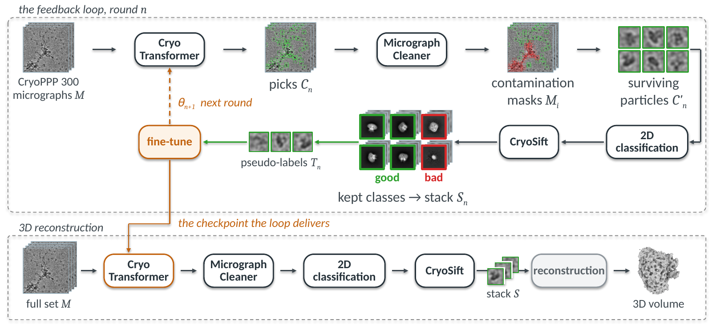

# Reconstruction-Aware Cryo-EM Particle Picking

Official implementation of *"Reconstruction-Aware Cryo-EM Particle Picking"*.

Extracting a clean particle stack from cryo-EM micrographs is usually split into
three sub-tasks: particle picking, contamination removal, and 2D class selection.
Each is trained and evaluated on its own, and none is optimized for the 3D
reconstruction that consumes their output. We treat the three as one selection
problem posed against reconstruction quality: CryoTransformer picks permissively,
a MicrographCleaner mask discards the candidates that fall on contamination,
CryoSift selects 2D classes by a continuous quality score, and the surviving
particles are fed back to fine-tune the picker.



The pipeline reaches a better resolution than every picker we compare, on all
four EMPIAR entries of CryoTransformer's independent test set.

---

## Table of Contents

- [Requirements](#requirements)
- [Installation](#installation)
- [Data download](#data-download)
- [Quick Start](#quick-start)
- [Full Step-by-Step Guide](#full-step-by-step-guide)
- [Reproducing the paper](#reproducing-the-paper)
- [Repository Structure](#repository-structure)
- [Citation](#citation)
- [Acknowledgements and Licensing](#acknowledgements-and-licensing)
- [TODO](#todo)

---

## Requirements

**CryoSPARC v4.7.x is required and is not installed by this repository.** Every
stage from particle extraction onward runs as a CryoSPARC job: extraction, 2D
classification, ab-initio reconstruction, homogeneous refinement, and local
resolution. A free non-commercial licence id is enough. See
[docs/CRYOSPARC.md](docs/CRYOSPARC.md) for the version requirement, the reason
v5.0.x is not targeted, and how to point this repository at your instance.

One GPU is enough; every stage occupies a single GPU. The paper's runs used
NVIDIA RTX A5000 cards with 24 GB each.

Time, measured on the full micrograph sets. Picking costs 0.49 to 0.55 seconds
per micrograph and applying the cached masks at most 75 seconds for an entire
entry, but the stages that touch every particle dominate: extraction with 2D
classification takes 2.6 to 5.0 hours, the CryoSift cycles 1.3 to 8.5 hours, and
one reconstruction arm of three ab-initio runs and three refinements 1.1 to 2.0
hours. A fine-tuning round takes just under two hours. Reproducing every
condition of the paper on all four entries is a matter of weeks, not hours, which
is why the intermediate artifacts are published; see
[Quick Start](#quick-start).

Disk: about 1.6 TB for the four entries at full-set scale.

---

## Installation

The stages need mutually incompatible Python environments, so there is one
environment per stage rather than one for the repository. `scripts/00_setup.sh`
clones the pinned upstream code and builds all of them from the committed
lockfiles under `envs/`.

```bash
git clone https://github.com/riku359/ReconAwarePick.git
cd ReconAwarePick
cp .env.example .env          # fill in your CryoSPARC licence id, e-mail, password
export RAPICK_DATA=/path/to/data      # inputs
export RAPICK_WORK=/path/to/work      # outputs
bash scripts/00_setup.sh
```

| Stage | Environment | Python | Framework |
| --- | --- | --- | --- |
| picking, fine-tuning | `envs/cryotransformer` | 3.7 | torch 1.13.1+cu117 |
| contamination masking | `envs/micrograph_cleaner` | 3.10 | TensorFlow 2.16 + Keras 3 |
| 2D class selection | `envs/cryosift` | 3.12 | torch 2.6 (CPU) |
| reconstruction | `envs/recon` | 3.10 | cryosparc-tools 4.7 |
| figures | `envs/figures` | 3.11 | matplotlib |

`uv` builds all of them except crYOLO, which needs conda; crYOLO is only required
to reproduce two tables, and [docs/BASELINES.md](docs/BASELINES.md) explains how
to avoid it. Keep the `uv` cache on a local SSD: its file locks hang on NFS.

Every path comes from an environment variable. The contract is in
[docs/CONFIGURATION.md](docs/CONFIGURATION.md); a script that cannot resolve one
fails naming the variable rather than falling back to a default.

---

## Data download

```bash
bash scripts/01_download_data.sh
```

| Asset | Contents | Source |
| --- | --- | --- |
| CryoPPP annotated subset | 300 micrographs and expert particle annotations per entry | [CryoPPP](https://github.com/BioinfoMachineLearning/cryoppp) |
| Full depositions | every micrograph of each entry: 997 / 1,873 / 1,644 / 1,556 | EMPIAR |
| CryoTransformer weights | the released checkpoint the head repair starts from | [calla.rnet.missouri.edu](https://calla.rnet.missouri.edu/CryoTransformer/pretrained_model.tar.gz) |
| MicrographCleaner weights | the released contamination network | [Zenodo](https://zenodo.org/records/17093439) |
| Repaired head, theta_0 | the base checkpoint of every condition (Sec. S2) | [🤗 rikrikrik/recon-aware-pick-weights](https://huggingface.co/rikrikrik/recon-aware-pick-weights) |
| Contamination masks | triangular-blend masks for all four entries at full-set scale | [🤗 rikrikrik/recon-aware-pick-data](https://huggingface.co/datasets/rikrikrik/recon-aware-pick-data) |
| Picks | the STAR files each condition starts from | same dataset |

The four entries are EMPIAR-10081, 10093, 10345 and 10532. Details, including the
two ways a downloaded `.mrc` can be silently corrupt and how to check, are in
[docs/DATA.md](docs/DATA.md).

---

## Quick Start

Running the whole pipeline takes weeks. To see one condition end to end without
re-deriving its inputs, download the published picks and masks and pick up from
the 2D classification:

```bash
bash scripts/01_download_data.sh --entry 10081 --intermediates
bash scripts/07_reconstruct.sh  --entry 10081 --condition mask   # extract, 2D classify
bash scripts/05_select2d.sh     --entry 10081 --condition both   # CryoSift's cycles
bash scripts/07_reconstruct.sh  --entry 10081 --condition both   # ab-initio to local res
```

The last step writes `$RAPICK_WORK/empiar_10081/full/both/metrics.json`. Compare
its resolution against `results/tables/ablation.json`, which holds the published
value, the unrounded one, and the three per-seed resolutions behind it.

To derive the picks and masks yourself instead, follow the step-by-step guide.

---

## Full Step-by-Step Guide

Each script covers one stage and takes `--entry` and `--condition`.

```bash
# Once per entry: the base checkpoint, its candidates, and the mask applied to them.
bash scripts/02_repair_head.sh                            # theta_0    (Sec. S2)
bash scripts/03_pick.sh  --entry 10081                    # candidates (Sec. 3.2)
bash scripts/04_mask.sh  --entry 10081                    # contamination (Sec. 3.3)

# The ablation rows of Table 4. `both` selects on the class_2D that `mask` built,
# so `mask` runs first.
bash scripts/07_reconstruct.sh --entry 10081 --condition baseline
bash scripts/07_reconstruct.sh --entry 10081 --condition mask
bash scripts/05_select2d.sh    --entry 10081 --condition both      # (Sec. 3.4)
bash scripts/07_reconstruct.sh --entry 10081 --condition both

# The feedback loop, on the 300 annotated micrographs (Sec. 3.5).
bash scripts/06_loop.sh --entry 10081 --rounds 3

# Ours: re-pick everything with the round-1 checkpoint, then the same two stages.
bash scripts/03_pick.sh --entry 10081 --out-name fb_raw \
    --checkpoint $RAPICK_WORK/loop/10081/round1/model.pth
bash scripts/04_mask.sh --entry 10081 --star $RAPICK_WORK/picks/10081/fb_raw.star --out-name fb
bash scripts/07_reconstruct.sh --entry 10081 --condition fb        # its own stack, to class_2D
bash scripts/05_select2d.sh    --entry 10081 --condition fb
bash scripts/07_reconstruct.sh --entry 10081 --condition fb        # ab-initio to local resolution

bash scripts/08_tables_figures.sh
```

`02` can be skipped by downloading theta_0 and `04` by downloading the masks;
`scripts/01_download_data.sh --intermediates` fetches both. `05` is resumable:
each cycle's re-classification runs for hours, and the job uids are recorded in
`state.json` before they are queued.

Each stage's README carries the details, the exact flags, and the traps:
[picker](src/rapick/picker/README.md) ·
[cleaner](src/rapick/cleaner/README.md) ·
[select2d](src/rapick/select2d/README.md) ·
[loop](src/rapick/loop/README.md) ·
[recon](src/rapick/recon/README.md) ·
[eval](src/rapick/eval/README.md)

---

## Reproducing the paper

[docs/PAPER_TO_CODE.md](docs/PAPER_TO_CODE.md) maps every table and figure to
what produces it, and defines the five condition names the whole repository uses.
[docs/REPRODUCE.md](docs/REPRODUCE.md) gives the commands table by table.

Every number the paper prints is in `results/tables/`, as JSON, together with the
unrounded per-seed values and the CryoSPARC job uid behind each one. You can
check the paper against them without running anything.

Two things do not reproduce exactly, and it is better to know before trying:
the camera placements behind the local-resolution maps of Fig. 3 were lost, so a
re-render gives the same maps at a different orientation, and the class-average
tiles of Fig. S1 came from CryoSPARC jobs whose scratch copies are gone.
[docs/PAPER_TO_CODE.md](docs/PAPER_TO_CODE.md) says what survives.

Three caveats bound what the numbers mean. Resolutions on EMPIAR-10345 follow
CryoPPP's declared pixel size, which is the super-resolution movie value, so they
are about half the physical figure and compare conditions within that entry only.
Resolution is best-of-three-seeds, and the seed-to-seed spread sometimes exceeds
the effect being measured. And the 2D scores against the CryoPPP annotations are
not held-out numbers, because 50 of the 300 annotated micrographs also train the
picker in each round.

---

## Repository Structure

```
ReconAwarePick/
├── src/rapick/              one package per pipeline stage
│   ├── picker/              CryoTransformer: head repair, picking, fine-tuning
│   ├── cleaner/             contamination masking, triangular window blending
│   ├── select2d/            CryoSift scoring and the iterative class selection
│   ├── loop/                the reconstruction-aware feedback loop
│   ├── recon/               the CryoSPARC v4.7 job chain
│   └── eval/                2D detection metrics and STAR conversion
├── configs/
│   ├── datasets/            one file per EMPIAR entry, both scales
│   ├── conditions/          baseline / mask / select / both / fb and the comparisons
│   └── cryosparc_v47.yaml   the job DAG contract
├── scripts/                 numbered drivers, 00 to 08
├── envs/                    per-stage lockfiles
├── results/tables/          every number the paper prints, with its provenance
├── results/figures/         the scripts that draw the paper's figures
├── docs/
├── third_party/             upstream checkouts, fetched by scripts/00_setup.sh
└── repos.lock.yaml          upstream URLs, pinned commits and licences
```

---

## Citation

To be updated once the proceedings citation is assigned.

---

## Acknowledgements and Licensing

Our own code is released under the [MIT License](LICENSE).

**Included in this repository.** Three files of
[CryoTransformer](https://github.com/jianlin-cheng/CryoTransformer) (MIT, (c) 2023
Jianlin Cheng) ship here in modified form, under
`src/rapick/picker/overlay/`, because the paper depends on those modifications.
The changes are readable as diffs in `src/rapick/picker/patches/` and the
upstream copyright notice is retained.

**Fetched, not redistributed.** Everything else is cloned at a pinned commit by
`scripts/00_setup.sh`; see `repos.lock.yaml`.

- [MicrographCleaner](https://github.com/rsanchezgarc/micrograph_cleaner_em)
  (Apache-2.0) — contamination masking. We call the released network unchanged and
  replace only its post-processing.
- [CryoSift](https://cryosift.org), upstream
  [Magellon](https://github.com/sstagg/Magellon) (Apache-2.0) — 2D class scoring.
  We call the released model unchanged and supply the iterative workflow around it.
- [Topaz](https://github.com/tbepler/topaz) (**GPL-3.0**) and
  [CryoSegNet](https://github.com/jianlin-cheng/CryoSegNet) (MIT) — comparison
  pickers.
- [crYOLO](https://cryolo.readthedocs.io/) — comparison picker, distributed under
  the MPI Dortmund Complimentary Science Software License (non-commercial). Not
  redistributable; install it yourself, or use the published picks instead.

**Data.** Micrographs and annotations come from
[CryoPPP](https://github.com/BioinfoMachineLearning/cryoppp) (data CC-BY-4.0) and
from [EMPIAR](https://www.ebi.ac.uk/empiar/). The STAR files and masks we publish
on Hugging Face are derived from them and are redistributed under **CC-BY-4.0**
with attribution.

If you use this code, please also cite **CryoTransformer**, **MicrographCleaner**,
**CryoSift**, **CryoPPP** and **CryoSPARC** alongside our paper.

---

## TODO

Pending for the public release:

- [ ] Replace the citation block with the proceedings citation
- [ ] Publish the four round-1 fine-tuned checkpoints (the `fb` condition's
      weights); until then the loop has to be re-run
- [ ] Publish the four pickers' full-set picks, so Table 2 can be reproduced
      without installing crYOLO, Topaz and CryoSegNet
- [ ] End-to-end check of one condition on a machine that has never run this code
- [ ] Run the `fb_gt` path once. Table 7's lower row was produced by scripts that
      were never committed; `--teacher gt` reimplements their documented procedure
      and has not been run in this form
- [ ] Generate and commit `envs/figures/uv.lock`, the one environment assembled for
      the release rather than during the experiments

[docs/RELEASE_CHECKLIST.md](docs/RELEASE_CHECKLIST.md) has the full list, in the
order it makes sense to do it, along with what this repository deliberately does
not contain and why.
