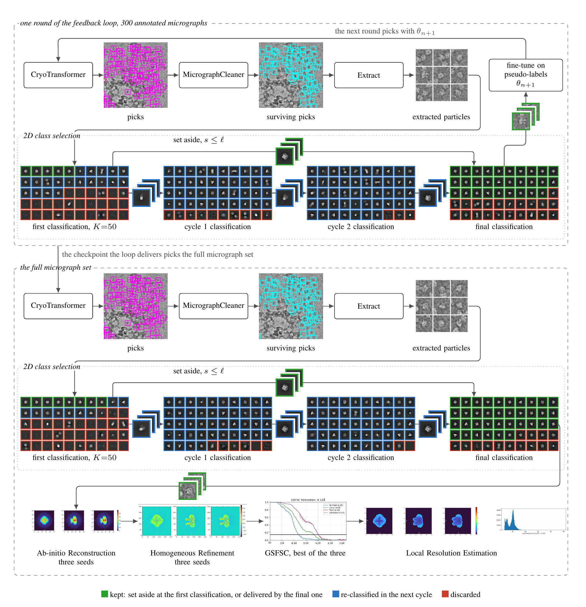

# CryoSPARC

Everything from particle extraction onward runs as a CryoSPARC job: extraction, 2D
classification, ab-initio reconstruction, homogeneous refinement, and local resolution.
**CryoSPARC is not installed by this repository, and it is not optional.**

## Versions

| CryoSPARC | Bundled CUDA | Minimum NVIDIA driver |
| --- | --- | --- |
| v4.4 – v4.7 | 11.8 | 520.61.05 |
| v5.0.x | 12.8 | 570.26 |

We used **v4.7.1**, and the pipeline targets v4.7.x for the driver, not the science:
v5.0.x needs driver >= 570.26, which many shared machines cannot get without a
maintenance window, while v4.4 – v4.7 bundle CUDA 11.8 and run on anything from
520.61.05 up. `configs/cryosparc_v47.yaml` records the job types and port names as they
exist on that release; another release can rename them.

`cryosparc-tools` must match the server's **minor** version. The pin is in
`envs/recon/pyproject.toml` and locked in `envs/recon/uv.lock`:

```
cryosparc-tools>=4.7,<4.8      # for a v4.7.x server
```

A v4.6 or v5.0 server needs the matching client and a re-locked environment.

## Setup

### 1. Install CryoSPARC

Request a licence id from Structura Biotechnology — a free non-commercial licence covers
everything here — and follow <https://guide.cryosparc.com/> for the master and worker
install. No modified CryoSPARC is needed.

### 2. Create the project

1. Open `http://<host>:<port>/` (default base port 39000).
2. **Projects** → **Create Project**. Point it at a disk with room for the particle
   stacks; they are much larger than the micrographs.
3. Read the uid off the project card (`P1`, `P2`, …).

One project holds everything, and the pipeline creates the workspaces itself: one per
(entry, scale), titled `<empiar id>_<setting>` (`10081_full`, `10081_annot`).

### 3. Find the worker hostname

```bash
cryosparcm cli "get_scheduler_targets()"
```

`CRYOSPARC_WORKER` is the `hostname` the jobs should be pinned to. Pinning matters: on a
multi-worker install an unpinned CPU job can land on an unreachable node (ssh error at
launch), and an unpinned GPU job on a card another user has already filled
(`CUDA_ERROR_OUT_OF_MEMORY` mid-run).

### 4. Fill in `.env`

Copy `.env.example` to `.env` at the repository root. It is git-ignored and is the only
file here that holds credentials.

```
CRYOSPARC_LICENSE_ID=
CRYOSPARC_EMAIL=
CRYOSPARC_PASSWORD=
CRYOSPARC_HOST=localhost
CRYOSPARC_PORT=39000
CRYOSPARC_WORKER=
CRYOSPARC_PROJECT=
```

`CRYOSPARC_HOST` and `CRYOSPARC_PORT` come from `cryosparc_master/config.sh`
(`CRYOSPARC_MASTER_HOSTNAME`, `CRYOSPARC_BASE_PORT`). `--project` and `--worker` override
`.env` for a single run; the project uid is never written into a config file.

### 5. Verify the job profile

Re-verify the profile after any upgrade, or on a new site, before spending GPU time:

```bash
PYTHONPATH=src envs/recon/.venv/bin/python \
  src/rapick/recon/scripts/smoke_probe.py --env .env --project <throwaway project uid>
```

It builds each candidate job, prints its ports and params, and deletes it. Nothing is
queued, so it costs no GPU time — but it does create jobs, so point it at a **throwaway
project**, never one holding results.

## The job chain (Fig. S1)

One chain per arm. Steps 1–2 run once per (entry, scale) and are shared by every
arm of that entry, so all arms are compared over identical CTF estimates.

Fig. S1 of the manuscript is that chain, drawn as TikZ over the panels CryoSPARC renders
for these jobs. It is reproduced here; the individual job panels behind it are not
committed — see [`CONDITIONS.md`](CONDITIONS.md).



| # | Job | Key | Notes | Device |
| --- | --- | --- | --- | --- |
| 1 | Import Micrographs | `import_micrographs` | shared; micrograph glob + the entry's optics (pixel size, voltage, Cs, dose) | CPU |
| 2 | Patch CTF Estimation (Multi) | `patch_ctf_estimation_multi` | shared | GPU |
| 3 | Import Particle Stack | `import_particles` | "Ignore raw data" — coordinates only, connected to step 1 | CPU |
| 4 | Extract From Micrographs (Multi) | `extract_micrographs_multi` | this arm's boxes, out of the CTF-estimated micrographs | GPU |
| 5 | 2D Classification | `class_2D` | 50 classes, 20 full iterations, one seed shared by all three trials | GPU |
| 6 | Select 2D Classes | `select_2D` | arms that select 2D classes only (`docs/CONDITIONS.md`) | — |
| 7 | Ab-Initio Reconstruction × 3 | `homo_abinit` | one class, forked over seeds 0, 1, 2 | GPU |
| 8 | Homogeneous Refinement × 3 | `homo_refine` | one per ab-initio, same seed | GPU |
| 9 | Best of three | — | lowest gold-standard FSC at 0.143; read by the pipeline, not a job | — |
| 10 | Local Resolution Estimation | `local_resolution` | winning refinement only; non-fatal | GPU |

Step 6 does not come off step 5 directly: it reconstructs the final selection of
CryoSift's iterative workflow, which sits several Select 2D / 2D Classification hops
above it. That part is `src/rapick/select2d/`, not this stage.

Outside the chain: **Orientation Diagnostics** — `orientation_diagnostics`, run over a
chosen refinement by `src/rapick/recon/scripts/run_orientation_diagnostics.py`. It is a
CPU job, so it is pinned to a worker without reserving a GPU.

Figures S6 and S7 are the FSC and viewing-direction panels CryoSPARC renders for step 8's
refinements; `collect` downloads them into each arm's `derived/`. No script here
draws them.

## What to watch for

The full list is in [`src/rapick/recon/README.md`](../src/rapick/recon/README.md#gotchas);
the short one: never set `compute_use_ssd: false` (2D classification dies with SIGFPE); a
`completed` job is not proof it was correct; `homo_abinit` clamps its input at a per-entry
particle cap; a single-seed resolution is not trustworthy.
